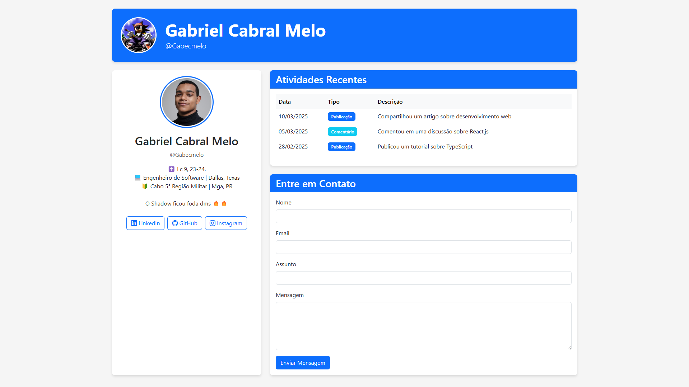

# Página de Perfil do Usuário



## 📝 Descrição

Este projeto consiste em uma página de perfil de usuário desenvolvida utilizando tecnologias web padrão. A página exibe informações detalhadas sobre o usuário Gabriel Cabral Melo (euzinho mesmo), incluindo seu nome, nome de usuário e biografia.

### Funcionalidades Principais:

- **Cabeçalho com Banner**: Exibe a foto de perfil, nome e nome de usuário em um banner destacado.
- **Seção de Informações do Usuário**: Mostra detalhes como nome, username e biografia completa.
- **Tabela de Atividades Recentes**: Apresenta as atividades do usuário com data, tipo e descrição.
- **Formulário de Contato**: Permite que visitantes enviem mensagens através de um formulário com validação.
- **Design Responsivo**: Adapta-se perfeitamente a diferentes tamanhos de tela (desktop, tablet e celular).

A página foi desenvolvida com foco em usabilidade e acessibilidade, seguindo as melhores práticas de desenvolvimento web.

## 🚀 Tecnologias Utilizadas

- **HTML5**: Estruturação do conteúdo
- **CSS3**: Estilização e layout
- **JavaScript**: Interatividade e validação de formulário
- **Bootstrap 5**: Framework para design responsivo

## 🔧 Como Usar

### Acesso Online

A página está disponível online através do seguinte link:
[https://gabecmelo.github.io/profile-page](https://gabecmelo.github.io/profile-page)

### Execução Local

Para executar o projeto localmente:

1. Clone o repositório:
   ```bash
   git clone https://github.com/gabecmelo/profile-page.git

2. Entre no diretório clonado:
   ```bash
   cd profile-page

3. Abra o arquivo index.html na web ou utilize uma extensão como Live Server para visualizar a página.